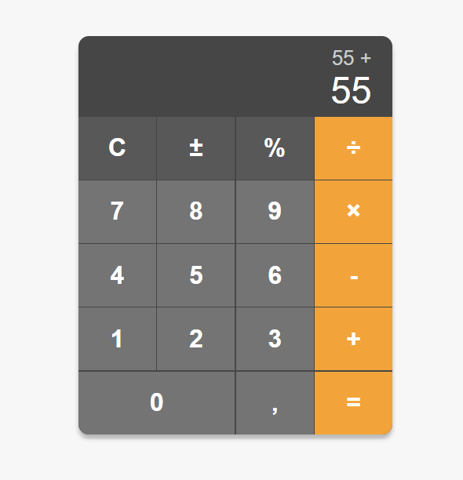

# Calculadora com Arquitetura MVC em Node.js


Este projeto implementa uma calculadora web simples com o objetivo principal de demonstrar a aplicação da arquitetura **MVC (Model-View-Controller)** em um ambiente Node.js com Express. A interface do usuário (View) é desacoplada da lógica de negócio (Model), com o Controller atuando como intermediário.



## ✨ Features

*   Operações aritméticas básicas: Adição, Subtração, Multiplicação e Divisão.
*   Suporte para números decimais.
*   Interface limpa e responsiva.
*   Lógica de cálculo processada no backend (servidor Node.js).
*   Histórico de operações visível na tela.

## 🏛️ Arquitetura MVC

O padrão MVC foi utilizado para separar as responsabilidades da aplicação, tornando o código mais organizado, escalável e fácil de manter.

*   **Model (`/src/models`):**
    *   Contém a lógica de negócio pura e o gerenciamento dos dados.
    *   No projeto, o `calculatorModel.js` é responsável exclusivamente por receber dois operandos e um operador, e retornar o resultado do cálculo. Ele não tem conhecimento sobre requisições HTTP ou a interface do usuário.

*   **View (`/public`):**
    *   É a camada de apresentação, responsável pela interface do usuário (UI).
    *   Consiste nos arquivos `index.html` e `script.js` (frontend) que rodam no navegador. A View captura as interações do usuário e as envia para o Controller.

*   **Controller (`/src/controllers`):**
    *   Atua como o intermediário entre o Model e a View.
    *   O `calculatorController.js` recebe as requisições HTTP da View, extrai os dados, chama as funções apropriadas do Model e envia a resposta de volta para a View.

## 🚀 Tecnologias Utilizadas

*   **Backend:** Node.js, Express.js
*   **Frontend:** HTML5, CSS3, JavaScript (Vanilla)
*   **Versionamento:** Git & GitHub

## ⚙️ Como Executar o Projeto

Para rodar este projeto localmente, siga os passos abaixo:

1.  **Clone o repositório:**
    ```bash
    git clone https://github.com/Vitorialuz229/calculadora-mvc.git
    ```

2.  **Navegue até a pasta do projeto:**
    ```bash
    cd calculadora-mvc
    ```

3.  **Instale as dependências do Node.js:**
    ```bash
    npm install
    ```

4.  **Inicie o servidor:**
    ```bash
    node server.js
    ```

5.  Abra seu navegador e acesse `http://localhost:3000`.

## 📡 API Endpoint

O projeto expõe um único endpoint para realizar os cálculos.

*   **Endpoint:** `POST /api/calculate`
*   **Descrição:** Recebe dois números e um operador e retorna o resultado.
*   **Corpo da Requisição (Request Body):**
    ```json
    {
      "firstOperand": 10,
      "secondOperand": 5,
      "operator": "+"
    }
    ```
*   **Resposta de Sucesso (Success Response):**
    ```json
    {
      "result": 15
    }
    ```
*   **Resposta de Erro (Error Response):**
    ```json
    {
      "error": "Erro: Divisão por zero"
    }
    ```

---

Feito por Vitória Luz <3